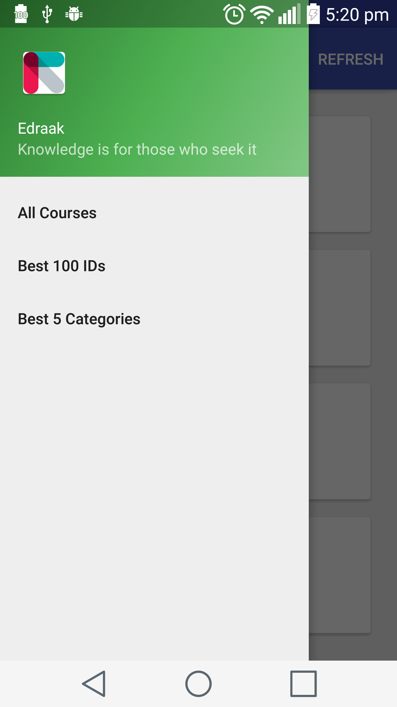
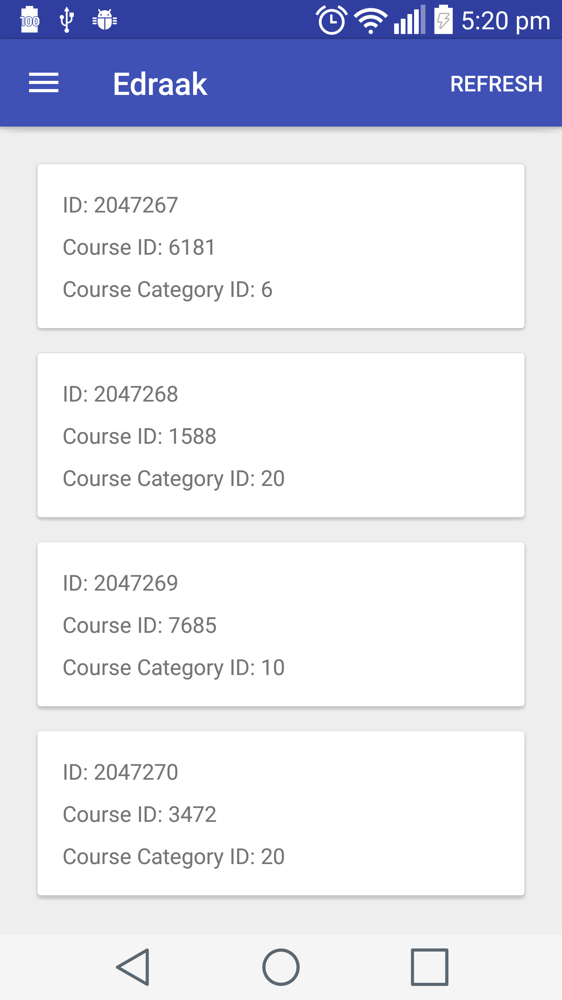

Edraak Test - Test App
================

**Edrak App** is a challenge app for [Edrak Organization][1] that uses an API to do the following:

 1. Implement an Infinitely Scrolling List in Android.
 2. Create a view that shows the most 100 popular course IDs and the 5 most popular course category IDs so far.

Building Instructions
------------------------
Start Android Studio and close any open Android Studio projects. From the Android Studio menu select File > New > Import Project. Alternatively, from the Welcome screen, select Import project (Eclipse ADT, Gradle, etc.). Select the Eclipse ADT project folder with the AndroidManifest.xml file and click Ok.

Required SDKs
============
- Android Sdk Version: 25
- Android Build Tools Version: 25.0.1

Main Packages
-----------
 - Activities - Android activities.
 - Fragments - Android fragments.
 - Adapters - Android adapters that extend `BaseListAdapter` which contains a lot of operations used in any adapter.
 - Utils - Static classes like parser.
 - Managers: Helpers, this package one class called `FilesCachingManager` that is responsible for caching the courses.
 - Models - Thin models and loaders represent M in [MVC][2]. The following are some main classes:
  - `LoaderRequestManager` - A manager to handle all shared [Retrofit][3] processes. It is a [generic class][4].
  - `CoursesCachingManager` - The courses manager for read / write courses to JSON file.

External Libraries
---------------------

 - [Retrofit][3]
 - [GSON][5]
 - [OkHttp][6]

Endless List
----------------
For the endless list (RecyclerVew) I implemented it using the adapter, so I created `BaseListAdapter` to be an abstract class.

Screenshots
-----------------
- Screenshot 1 

- Screenshot 2 

[1]: https://www.edraak.org
[2]: https://en.wikipedia.org/wiki/Model%E2%80%93view%E2%80%93controller "MVC"
[3]: https://github.com/square/retrofit "Retrofit"
[4]: https://en.wikipedia.org/wiki/Generics_in_Java "Generics in Java"
[5]: https://github.com/google/gson "GSON"
[6]: https://github.com/square/okhttp "OkHttp"